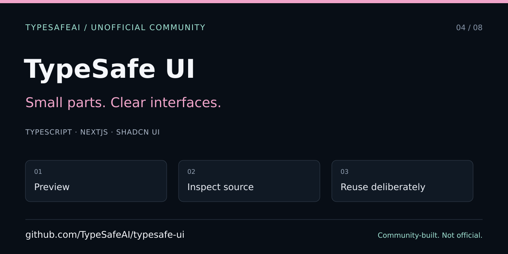

# TypeSafe UI — developer and agent entry point

> Unofficial TypeSafeAI community workspace, not an official SDK or published npm component package. Community organization created by VC Moderator [@BunsDev](https://github.com/BunsDev).



[Quick start](../../README.md) · [Agent instructions](../../AGENTS.md) · [Contributing](../../CONTRIBUTING.md) · [Jev Labs](../jev-labs.md)

## Toolchain and source map

Use the exact pnpm version in the root manifest and `pnpm install --frozen-lockfile`. Preserve workspace dependencies and the single lockfile. Components are source in `@workspace/ui`, not an assumed public npm package.

| Area | Responsibility |
| --- | --- |
| `apps/web/app` | Routes, layout, fonts, and metadata |
| `apps/web/lib/site.ts` | Site identity, public URL, language, and direction |
| `apps/web/lib/registry.ts` | Component IDs and source/export paths |
| `apps/web/components/demos.tsx` | Interactive previews |
| `packages/ui` | Reusable components and design tokens |
| `apps/web/app/opengraph-image.tsx` | Public PNG sharing card; no provider calls or request data |

Register a new component and its demo together. Keep displayed source, exports, import examples, keyboard behavior, themes, and RTL aligned. Preserve Base UI composition rather than assuming Radix-style props.

## Verification

```sh
pnpm lint
pnpm typecheck
pnpm build
pnpm test:e2e
node --test scripts/social-metadata.test.mjs
```

The root has an E2E script but no general `pnpm test` script. The standalone Node test checks source invariants; it does not prove a deployed image response. For browser work, inspect Preview/Source, Install/Import, Lab, narrow layouts, themes, RTL, keyboard focus, and reduced motion.

## Share the project

The generated `opengraph-image` metadata route provides a 1200×630 PNG. Twitter metadata points to the same public card. After a successful build/deployment, inspect rendered metadata and fetch the image to verify HTTP 200, PNG content type, dimensions, and legible copy. The configured origin remains in `site.ts`; verify the actual deployment before changing it or introducing canonical redirects.

The SVG in this guide is a separate editable 1280×640 repository card. It is not a product screenshot or an applied GitHub Social preview setting. Follow the [shared publishing guide](https://github.com/TypeSafeAI/.github/blob/main/docs/discovery/SHARING.md).

For screenshots, use local fixture previews, no provider keys, and record the source commit, component/route, viewport, theme, locale/direction, and environment. Keep fixture/live labels visible and review captures for private data. Follow the [evidence protocol](https://github.com/TypeSafeAI/.github/blob/main/docs/discovery/SCREENSHOTS.md). Do not claim new screenshots or accessibility verification without performing them.
